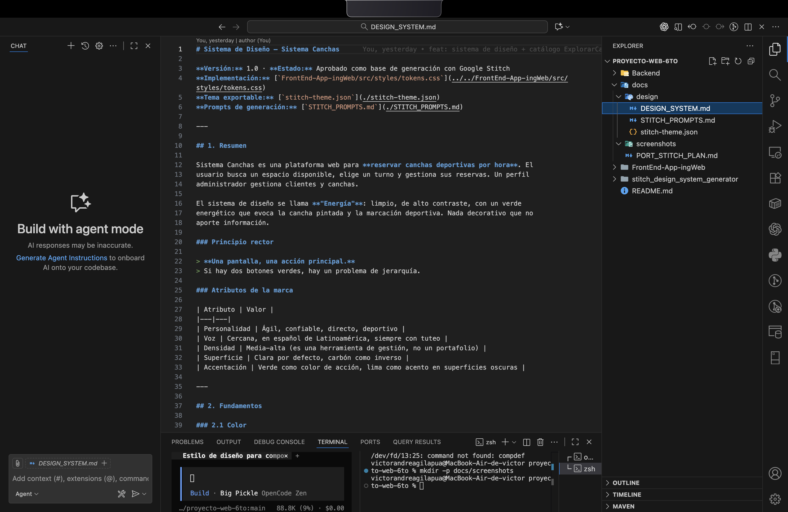
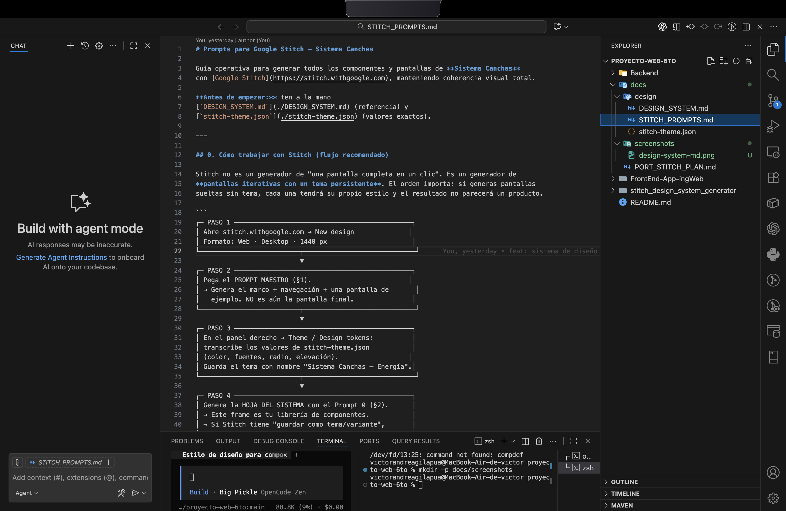
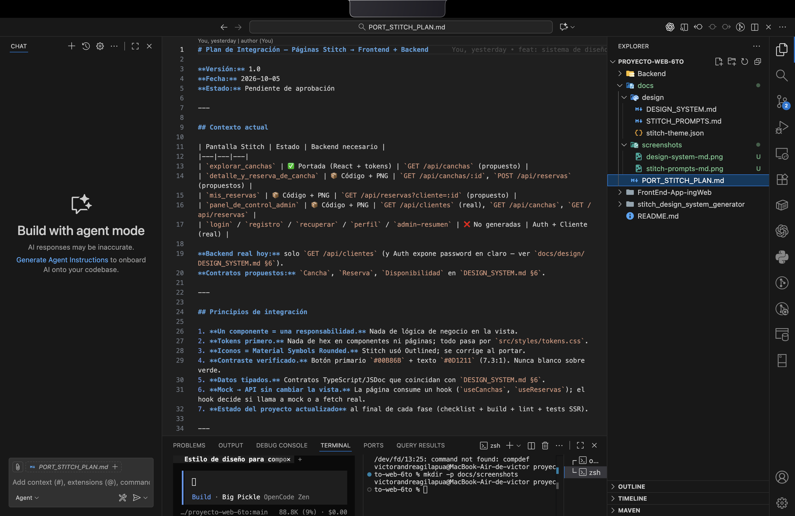
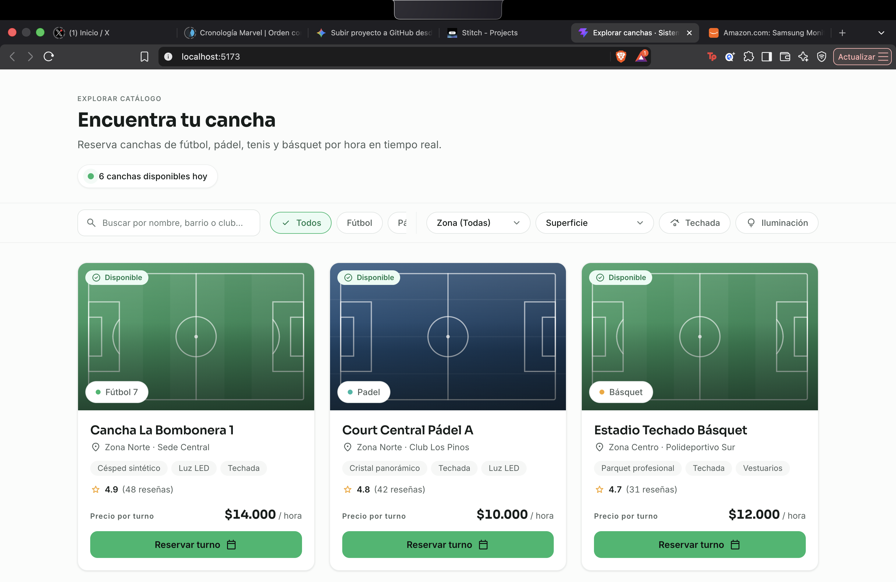
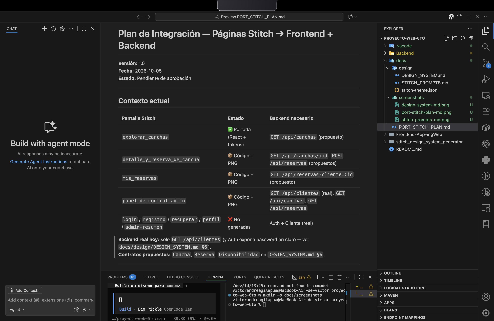

# Sistema Canchas

> Sistema de reservas de canchas deportivas — **diseño moderno, verde energía**, tokens CSS + React + Vite.  
> Sistema de diseño operable + catálogo de componentes validado en navegador + plan de integración por fases.

---

## Estado actual (commit `080c87e`)

| Área | Estado |
|------|--------|
| **Sistema de diseño** | ✅ Completo (tokens, base, componentes, docs) |
| **Catálogo ExplorarCanchas** | ✅ Portado desde Stitch + verificado |
| **Detalle + Reserva** | 📦 Código Stitch listo — pendiente FASE 2 |
| **Mis Reservas** | 📦 Código Stitch listo — pendiente FASE 3 |
| **Panel Admin** | 📦 Código Stitch listo — pendiente FASE 4 |
| **Auth / Perfil** | ❌ No generadas en Stitch — pendiente FASE 5 |
| **Backend real** | Solo `GET /api/clientes` — contratos propuestos en `docs/design/DESIGN_SYSTEM.md §6` |

---

## Capturas de lo entregado hoy

### 1. Documentación generada (`.md`)

| Documento | Captura |
|-----------|---------|
| **DESIGN_SYSTEM.md** — Especificación completa (tokens, componentes, contratos, accesibilidad) |  |
| **STITCH_PROMPTS.md** — 10 prompts (P1–P10) para generar pantallas en Google Stitch |  |
| **PORT_STITCH_PLAN.md** — Plan de integración 6 fases, ~14–18 días |  |

> **Acción requerida:** Abre cada `.md` en tu editor/visor (VS Code, GitHub, Obsidian) y haz captura de la vista renderizada. Guarda en `docs/screenshots/` con los nombres de arriba.

---

### 2. Google Stitch — Pantallas generadas

| Vista en Stitch | Captura |
|-----------------|---------|
| **Dashboard Stitch** con las 4 pantallas generadas (Explorar, Detalle, Mis Reservas, Admin) |  |
| **Explorar canchas** — código + preview |  |
| **Detalle y reserva** — código + preview |  |
| **Mis reservas** — código + preview |  |
| **Panel de control admin** — código + preview |  |

> **Acción requerida:** En Google Stitch, abre el proyecto "Sistema Canchas", haz captura de:
> 1. La vista general del proyecto (las 4 pantallas en la sidebar)
> 2. Cada pantalla individual con su preview visible
> Guarda en `docs/screenshots/` con los nombres de arriba.

---

### 3. Plan de trabajo (este documento)

| Elemento | Captura |
|----------|---------|
| **PORT_STITCH_PLAN.md** renderizado (tabla de fases, principios, riesgos) |  |

> **Acción requerida:** Captura del `PORT_STITCH_PLAN.md` abierto en GitHub o VS Code (vista renderizada, no código).

---

## Capturas pendientes (fases futuras)

| Fase | Pantallas a capturar cuando estén listas |
|------|------------------------------------------|
| **FASE 1** (hecha) | `catalogo-desktop.png`, `catalogo-movil.png` |
| **FASE 2** | `detalle-cancha-desktop.png`, `detalle-cancha-movil.png`, `reserva-modal.png` |
| **FASE 3** | `mis-reservas-desktop.png`, `mis-reservas-movil.png` |
| **FASE 4** | `panel-admin-clientes.png`, `panel-admin-canchas.png`, `panel-admin-reservas.png`, `panel-admin-resumen.png` |
| **FASE 5** | `login.png`, `registro.png`, `recuperar-clave.png`, `perfil.png` |
| **FASE 6** | `admin-resumen-final.png`, `style-guide-completo.png` |

> **Convención de nombres:** `kebab-case.png`, ancho ≤ 1600 px, tema claro (`data-theme="light"`), optimizados (≤ 300 KB).

---

## Arquitectura rápida

```
FrontEnd-App-ingWeb/
├── src/
│   ├── api/              # Cliente HTTP + endpoints (mock ↔ real por env)
│   ├── components/
│   │   ├── ui/           # 12 primitivas (Button, Input, Modal, DataTable…)
│   │   ├── canchas/      # CanchaCard, CanchaDetail, SlotGrid, ReservaModal
│   │   ├── reservas/     # ReservaList, ReservaCard, ReservaActions
│   │   ├── admin/        # ClienteTable, StatsCards, AdminSidebar
│   │   └── layout/       # Header, Footer, PageShell
│   ├── hooks/            # useCanchas, useReservas, useAuth, useApi
│   ├── lib/              # mockData, filtroCanchas, cx, format, rutas
│   ├── pages/            # ExplorarCanchas, DetalleCancha, MisReservas, PanelAdmin, Login, StyleGuide…
│   ├── styles/
│   │   ├── tokens.css    # 201 tokens — FUENTE ÚNICA DE VERDAD
│   │   ├── base.css
│   │   ├── components.css
│   │   └── pages/        # CSS por página
│   ├── App.jsx           # Hash routing (#/ #/estilo #/cancha/:id …)
│   └── main.jsx
├── docs/
│   ├── design/           # DESIGN_SYSTEM.md, STITCH_PROMPTS.md, stitch-theme.json
│   ├── PORT_STITCH_PLAN.md
│   └── screenshots/      # ← AQUÍ VAN TODAS LAS CAPTURAS
└── stitch_design_system_generator/  # Exports originales de Stitch (solo lectura)
```

---

## Scripts

```bash
# Desarrollo
npm run dev              # http://localhost:5173  (catálogo)
# http://localhost:5173/#/estilo  (style guide)

# Verificación obligatoria antes de commit
npx vite build           # Build producción
node node_modules/eslint/bin/eslint.js src   # Lint 0 errores
node -e "
const {transform}=require('lightningcss');
const fs=require('fs');
['src/index.css','src/styles/tokens.css','src/styles/base.css','src/styles/components.css','src/pages/StyleGuide.css','src/pages/ExplorarCanchas.css'].forEach(f=>transform({filename:f,code:Buffer.from(fs.readFileSync(f)),minify:true}));
console.log('CSS OK');
"

# Variables de entorno
cp .env.example .env
# VITE_API_BASE=http://localhost:8080
# VITE_USE_MOCK=true
```

---

## Principios no negociables

1. **Tokens = fuente única.** Cero hex fuera de `tokens.css` (salvo `theme-color` en `index.html`).
2. **Contraste verificado.** Botón primario `#00B86B` + texto `#0D1211` (7.3:1). Nunca blanco sobre verde (2.6:1).
3. **Iconos = Material Symbols Rounded.** Stitch generó Outlined; se corrige al portar.
4. **Radios en escala:** 8 / 12 / 16 / 28 / 999 px. Nada de `rounded-xl` arbitrario.
5. **Campos con etiqueta visible.** Nunca solo `placeholder`.
6. **Formato:** Hora 24 h (`18:00 – 20:00`), precios `$12.000 / hora`, códigos `SC-XXXXX`.
7. **Mock ↔ API sin tocar la vista.** Hooks deciden por `VITE_USE_MOCK`.

---

## Cómo continuar

1. **Añade las 9 capturas de hoy** en `docs/screenshots/` (ver tabla arriba).
2. **Actualiza este README** confirmando que están (cambia `` por rutas reales).
3. **Commit atómico:**
   ```bash
   git add docs/screenshots/*.png README.md
   git commit -m "docs: capturas entrega inicial — DESIGN_SYSTEM, STITCH_PROMPTS, PORT_STITCH_PLAN, Stitch dashboard + 4 pantallas"
   ```
4. **Próxima fase:** Revisa `docs/PORT_STITCH_PLAN.md` → decide si arrancamos **FASE 0** (mock API) o **FASE 2** (backend ya listo).

---

## Licencia

Proyecto académico / interno — sin licencia pública por ahora.